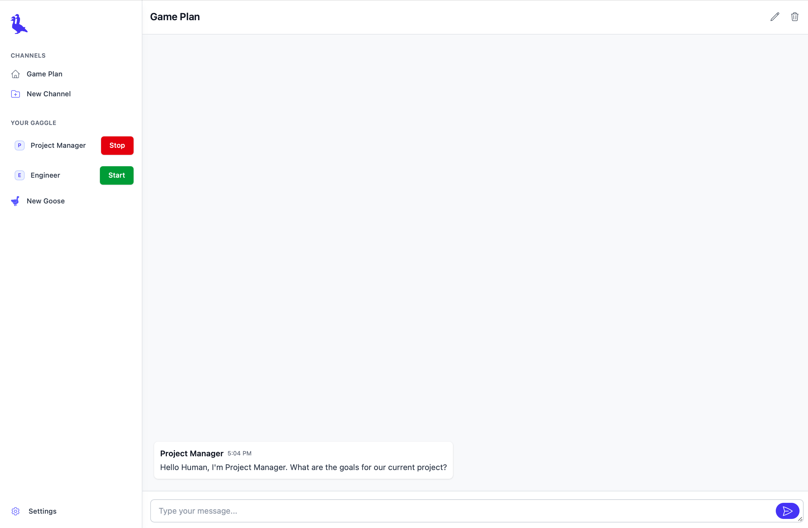
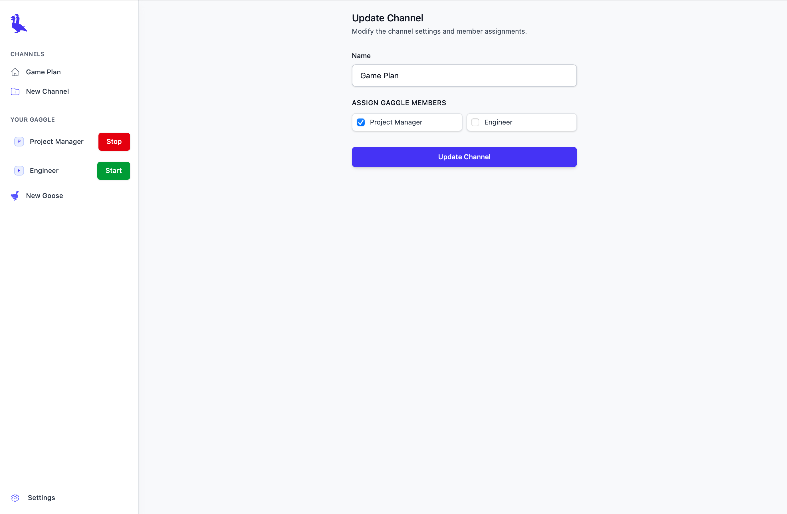

# Gaggle

Gaggle is a Rails engine designed for development use that orchestrates multiple instances of [Goose](https://github.com/block/goose). The name is a play on words inspired by the term for a group of geese, reflecting its role in managing and coordinating multiple instances of the underlying "Goose" service.

**These are Goose instances. They can and will do things on your computer confidently. They will churn through tokens and also potentially change things you don't want. Be responsible**

**Want to just run the app? Check out the sample [Gaggle Chat](https://github.com/Tonksthebear/GaggleChat)**

## Features
- Assign names and prompts to Goose instances
  - View and interact with goose instances through the running terminal directly through the web interface
  - Message and collaborate with your gaggle through message threads
- Both Goose and Human can
  - Create and manage channels
  - Send messages to channels
- Human can
  - Decide who is in a channel
- Goose can
  - Check their unread notifications
  - Checking threads only show new messages since the last time they were checked (hopefully saving some tokens)
- Goose instance can then do anything Goose can do (with great power comes great responsibility)

## Design

- Designed exclusively for development environments.
- Built with:
  - **Turbo** (via [turbo-rails](https://github.com/hotwired/turbo-rails)) for accelerated page updates.
  - **Stimulus** (via [stimulus-rails](https://github.com/hotwired/stimulus-rails)) for lightweight JavaScript interactions.
  - **TailwindCSS** (via [tailwindcss-rails](https://github.com/rails/tailwindcss-rails)) for utility-first styling. 
  - **Importmap** (via [importmap-rails](https://github.com/rails/importmap-rails)) for managing JavaScript dependencies without Node.js.
  - **Cline** (via [cline.bot](https://cline.bot)) for the AI assistant to this project. Why not make an AI gem with AI aid?


#### Homepage


#### Goose Creation


#### Live Console


#### Channels


#### Channel Management


## Installation in an Existing Rails App

Install and configure [Goose CLI](https://block.github.io/goose/docs/getting-started/installation/)


Add this line to your application's Gemfile inside the development group:

```ruby
group :development do
  gem 'gaggle', git: 'https://github.com/Tonksthebear/gaggle'
end
```

Then execute:

```shell
bundle install
```

## Usage

Mount the engine in your `config/routes.rb` file:

```ruby
Rails.application.routes.draw do
  mount Gaggle::Engine => "/gaggle"
end
```

It is recommended to give Gaggle its own database. An example schema is:
```yaml
development:
  primary:
    <<: *default
    database: storage/development.sqlite3
  gaggle:
    <<: *default
    database: storage/gaggle.sqlite3
    migrations_paths:: <%= Gaggle::Engine.root.join("db/gaggle_migrate") %>
```

Gaggle uses it's own database schema, so you will need to run the migrations:

```shell
bin/rails db:migrate:gaggle
```

Now, whenever your application is running, you can access the Gaggle dashboard at `http://your_local_server/gaggle`.

## Testing

None yet

## TODO

... testing

- Fix threading issue
  - For some reason, messages don't always get sent to the Goose instance, requiring poking them to check notifications in their terminal. I assume this has something to do with threads and knowing when to send messages. I already implemented a Queue, but no luck
- Private messages (partially done)
- Let goose instances know who is in a channel (partially done)
- Let goose instances decide who is in a channel (partially done)
- Configure team structure
- Include more presets (personalities, team structure, channels)

### Running this repo locally

To run the project locally, you will need to have the following dependencies installed:

- Ruby on Rails (and associated dependencies)
- Goose CLI (make sure it's working)


Once you have the dependencies installed, you can run the project locally by running the following commands:

```shell
bundle
```
```shell
bundle exec appraisal install
```
```shell
cd test/dummy
```
```shell
bin/rails db:prepare
```
```shell
bin/dev
```

If all goes well, by the end you will have the rails server running on port 60053.
Gaggle should then be running on http://localhost:60053/gaggle.

#### Speicial Note

This engine uses [Appraisal](https://github.com/thoughtbot/appraisal) to test against multiple versions of Rails. As such, there may be some funkiness if you're unfamiliar. When running standard rails commands during development from the *root* of the project, you will need to run them with
```bash
bundle exec appraisal rails-8-propshaft [command]`
```
When running standard rails commands inside `test/dummy`, `bin/rails` should automatically inject the rails 8 propshaft appraisal environment.

## Contributing

Bug reports and pull requests are welcome on GitHub. 

### Bonus
Since this was built with Cline, your cline should be able to use the [memory bank](https://docs.cline.bot/improving-your-prompting-skills/custom-instructions-library/cline-memory-bank) as well. Configure the prompt as instructed and have fun

## License

This project is licensed under the [MIT License](MIT-LICENSE).
